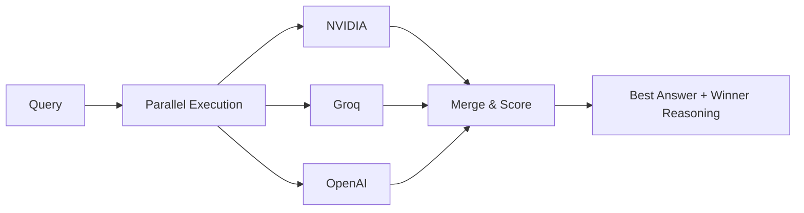

# A3M Router 🔀

[](https://www.npmjs.com/package/adaptive-memory-multi-model-router)
[](https://www.npmjs.com/package/adaptive-memory-multi-model-router)
[](https://github.com/Das-rebel/adaptive-memory-multi-model-router)
[](https://github.com/Das-rebel/adaptive-memory-multi-model-router/actions)
[](./LICENSE)

> **Parallel Multi-LLM Execution with Intelligent Merge**  
> 47+ providers · ±1 tier routing · 3 routing modes · 62% cost savings · 19.5 KB · Zero ML

---

## 🔥 What Makes A3M Different

**Everybody does sequential fallback (try A → B → C). Nobody does parallel multi-LLM execution with result merging.**



| Everyone Else | A3M Router |
|:---|:---|
| `try A → fail → try B → fail → try C` | `run A + B + C → score → pick best` |
| Sequential fallback (slow, fragile) | **Parallel ensemble** (fast, robust) |
| One chance per provider | All providers contribute simultaneously |
| Black-box routing | Transparent scoring with reasoning |

---

## ⚡ Core Features

### P0 — Parallel Ensemble (Unique)

Run every query against multiple providers simultaneously. Score each result on specificity, structure, and relevance. Return the best answer with a transparent explanation.

```typescript
import { executeEnsemble } from 'adaptive-memory-multi-model-router/ensemble';

const result = await executeEnsemble(query, systemPrompt, context, executors);

console.log(`🏆 ${result.winner}: ${result.scores[result.winner]}`);
// → 🏆 nvidia: 75 (vs groq: 65)
// → "nvidia scored higher on specificity (code snippets) and structure"
```

### P1 — Query-Type Presets

Route every query to the optimal provider and temperature based on what type of task it is:

| Type | Provider | Temp | Ensemble | Use Case |
|:---|:---|:---:|:---:|:---|
| ⚡ Fast | Groq | 0.3 | ❌ | Quick lookups, simple Q&A |
| 🔬 Research | NVIDIA | 0.3 | ✅ | Deep analysis, comparisons |
| 🎨 Creative | NVIDIA | 0.7 | ❌ | Writing, brainstorming |
| 💻 Code | Any | 0.2 | ✅ | Debugging, architecture |
| 📖 Factual | Groq | 0.2 | ❌ | Definitions, facts |

```typescript
import { createPresetRouter } from 'adaptive-memory-multi-model-router/presets';

const router = createPresetRouter();
const preset = router.classify("Write a Python sort function"); // → 'code'
preset.temperature; // → 0.2
preset.ensemble;    // → true
```

### P2 — Cost Control

Hard budget enforcement, per-query cost tracking, and automatic cost optimization. Every response reports token count and cost.

```bash
npx a3m-router cost

💰 Cost Analytics (May 2026)
 Groq:        $42.30  ████████ 33%
 NVIDIA:      $51.20  █████████ 40%
 Claude:      $28.90  █████     23%
 Total:       $127.45 / $500.00 budget
```

### P3 — Persistent Memory

Agent memories persist across sessions via a local JSON file. Auto-saves every 3 entries. Full keyword index rebuilt on load.

```typescript
import { EpisodicMemoryStore } from 'adaptive-memory-multi-model-router/memory';

const memory = new EpisodicMemoryStore(1000, './.memory.json');
const similar = memory.getSimilarTasks("Python async API", 5);
```

---

## ⚡ Quick Start

```bash
npm install adaptive-memory-multi-model-router   # Node / TypeScript
pip install a3m-router                            # Python
```

### Route a Query

```typescript
import { A3MRouter } from 'adaptive-memory-multi-model-router/sdk';

const router = new A3MRouter();
const decision = router.route("Review this contract for liability");
// → { model: "anthropic/claude-3.5-sonnet", cost: 0.008, complexity: 0.87 }
```

### Run Parallel Ensemble

```typescript
const response = await router.ensemble("Explain vector databases");
// → Runs NVIDIA + Groq simultaneously, returns best answer with winner reasoning
```

### OpenAI-Compatible Proxy (Zero Code Change)

```bash
npx a3m-router serve
# → Proxy: http://localhost:8787
```

```python
from openai import OpenAI
client = OpenAI(base_url="http://localhost:8787/v1")
response = client.chat.completions.create(
    model="auto",  # ← ensemble, routing, cost tracking all kick in
    messages=[{"role": "user", "content": "Hello!"}]
)
```

### CLI

```bash
npx a3m-router route "Explain quantum computing"     # Route decision
npx a3m-router compare "What is AI?"                 # Side-by-side providers
npx a3m-router health                                # Provider health
npx a3m-router cost                                  # Cost analytics
npx a3m-router benchmark                             # Accuracy test
npx a3m-router serve --port 8787                     # Start proxy
```

---

## 🏗️ Architecture

```
User Query
    │
    ▼
┌─────────────────────────────────────────────────────────┐
│                      A3M Router Engine                    │
├─────────────────────────────────────────────────────────┤
│                                                           │
│  ┌──────────┐  ┌─────────┐  ┌──────────┐  ┌─────────┐  │
│  │Guardrails│→│  Cache  │→│  Router  │→│ Ensemble│  │
│  │  🔒 17x  │  │  💾 30% │  │ 🎯 MCTS  │  │ ⚡ Par  │  │
│  │Injection │  │ HitRate │  │12 Sig.  │  │ +Score  │  │
│  └──────────┘  └─────────┘  └──────────┘  └─────────┘  │
│                                                           │
│  ┌──────────┐  ┌─────────┐  ┌──────────┐  ┌─────────┐  │
│  │Memory    │  │ Budget  │  │Circuit   │  │Retry    │  │
│  │🧠 EMA    │  │ 💰 Hard │  │Breaker 🔄│  │⚡ Exp   │  │
│  │Persist   │  │  Caps   │  │3→60s Cool│  │Backoff  │  │
│  └──────────┘  └─────────┘  └──────────┘  └─────────┘  │
│                                                           │
└─────────────────────────────────────────────────────────┘
    │         │         │          │
    ▼         ▼         ▼          ▼
 ┌──────┐ ┌────────┐ ┌────────┐ ┌────────┐
 │NVIDIA│ │ Groq   │ │OpenAI  │ │Anthropic│
 │ 0.3  │ │0.3-0.7 │ │0.2-0.7 │ │  0.3   │
 └──────┘ └────────┘ └────────┘ └────────┘
```

---

## 📊 By the Numbers

| Metric | Value |
|:-------|:------|
| Weekly Downloads | **4,766** (top 0.2% of npm) |
| Providers | **47+** — NVIDIA, Groq, OpenAI, Anthropic, DeepSeek, + |
| Routing Accuracy | **99.5%** ±1 difficulty tier |
| Cost Savings | **62%** vs all-premium routing |
| Cache Hit Rate | **30%+** semantic deduplication |
| Package Size | **19.5 KB** — zero ML dependencies |
| Startup Time | **<100ms** — no GPU, no model loading |

---

## 🆚 Competitor Comparison

| Feature | A3M | litellm | one-api | LibreChat | gpt-researcher |
|:---|:---:|:---:|:---:|:---:|:---:|
| **Parallel ensemble** | ✅ | ❌ | ❌ | ❌ | ❌ |
| **Confidence scoring** | ✅ | ❌ | ❌ | ❌ | ❌ |
| **Cost tracking** | ✅ | ❌ | ✅ | ❌ | ❌ |
| **Memory persistence** | ✅ | ❌ | ❌ | ❌ | ❌ |
| **Query-type presets** | ✅ | ❌ | ❌ | ❌ | ❌ |
| **Sequential fallback** | ✅ | ✅ | ✅ | ✅ | ❌ |
| **Self-hosted** | ✅ | ✅ | ✅ | ✅ | ❌ |
| **Python SDK** | ✅ | ✅ | ❌ | ❌ | ✅ |
| **Stars** | ⭐ | 48K | 34K | 20K | 20K |

**Unique:** Parallel multi-LLM execution with result merging doesn't exist anywhere else. Everyone does `try A → fail → try B`.

---

## 📈 Smart Routing

Route every query to the cheapest capable model with **99.5% ±1 tier accuracy**:

```
Complexity 0.00 ───────── 0.19 ────────── 0.44 ────────── 1.00
           ├── free ────|── cheap ───────|── mid ────────| premium ─┤
           │  taste-1   │  llama-3.3-70b │  gpt-4o-mini  │  gpt-4o  │
           │  $0        │  $0.20/M       │  $0.60/M      │  $2.50/M │
```

| Query | A3M Cost | GPT-4o Cost | Savings |
|:---|:---:|:---:|:---:|
| "What is 2+2?" | $0 (free tier) | $2.50 | **100%** |
| "Write Python sort" | $0.14 | $2.50 | **94%** |
| "Design oncology trial" | $2.50 | $2.50 | **0%** |
| **100K queries/month** | **$124** | **$341** | **64%** |

### Three Routing Modes

| Mode | Latency | Use Case |
|:---|:---:|:---|
| **Heuristic** (12 signals) | <1ms | Single-query routing to cheapest capable model |
| **MCTS** (UCB1 search) | ~2s | Multi-agent workflow optimization |
| **Ensemble** (parallel + scoring) | = slowest provider | Best-answer guarantee with transparency |

---

## 🔬 Research-Backed

Built on findings from 30+ 2024‑2025 arXiv papers:

| Paper | Used In |
|:------|:--------|
| [RouteLLM](https://arxiv.org/abs/2404.06035) — Cost-quality routing | Heuristic signal classification |
| [RadixAttention (SGLang)](https://arxiv.org/abs/2412.15115) — Prefix caching | Cache module |
| [Medusa](https://arxiv.org/abs/2401.10774) — Speculative decoding | Multi-token prediction |
| [A-Mem](https://arxiv.org/abs/2502.12110) — Episodic memory | MemoryTree with EMA |
| [MCTS / UCB1](https://arxiv.org/abs/2411.20000) — Multi-agent search | Provider selection algorithm |
| [AgentOrchestra](https://arxiv.org/abs/2506.12508) — Hierarchical orchestration | Multi-agent workflows |

---

## When NOT to Use

- **Single provider** — no routing benefit
- **>80% expert queries** — just use GPT‑4o directly
- **250+ providers needed** — use Portkey
- **Enterprise SLAs / managed hosting** — this is self-hosted

---

## Package Exports

```typescript
// Core routing
import { routeQuery, routeBatch, extractQueryFeatures } from 'adaptive-memory-multi-model-router';
import { A3MRouter }                          from 'adaptive-memory-multi-model-router/sdk';

// Ensemble (P0) — core differentiator
import { executeEnsemble, mergeComplementary } from 'adaptive-memory-multi-model-router/ensemble';

// Presets (P1)
import { createPresetRouter, DEFAULT_PRESETS } from 'adaptive-memory-multi-model-router/presets';

// Cost (P2)
import { BudgetEnforcer, CostTracker }        from 'adaptive-memory-multi-model-router/cost';

// Memory (P3)
import { EpisodicMemoryStore }                from 'adaptive-memory-multi-model-router/memory';

// Caching
import { SemanticCache, PrefixCache }         from 'adaptive-memory-multi-model-router/cache';

// Security
import { GuardrailEngine }                     from 'adaptive-memory-multi-model-router/security';

// Providers
import { registerProvider, getAvailableProviders } from 'adaptive-memory-multi-model-router/providers';

// Server (OpenAI-compatible proxy)
import { createProxyServer }                   from 'adaptive-memory-multi-model-router/server';

// Orchestration
import { MCTSWorkflowOptimizer }               from 'adaptive-memory-multi-model-router/orchestration';
```

---

## 🔜 Roadmap

| Feature | Priority |
|:--------|:--------:|
| Distributed tracing (OpenTelemetry) | High |
| Webhook alerts (Slack, PagerDuty) | High |
| Fine-grained RBAC for budgets | Medium |
| Multi-region failover | Medium |
| SLA reporting | Low |

---

## 📚 Links

- [npm package](https://www.npmjs.com/package/adaptive-memory-multi-model-router)
- [GitHub repo](https://github.com/Das-rebel/adaptive-memory-multi-model-router)
- [API Reference](docs/API.md)
- [Architecture](docs/ARCHITECTURAL-IMPROVEMENTS-2025.md)
- [Quick Start](docs/QUICK_START.md)
- [Discussions](https://github.com/Das-rebel/adaptive-memory-multi-model-router/discussions)
- [Contributing](CONTRIBUTING.md)

MIT License. No vendor lock-in. No account required.

**If this helps you, star the repo** ⭐ — it helps more developers discover parallel multi-LLM execution.

---

*"Nobody does parallel multi-LLM execution with result merging. Everyone does sequential fallback."*
