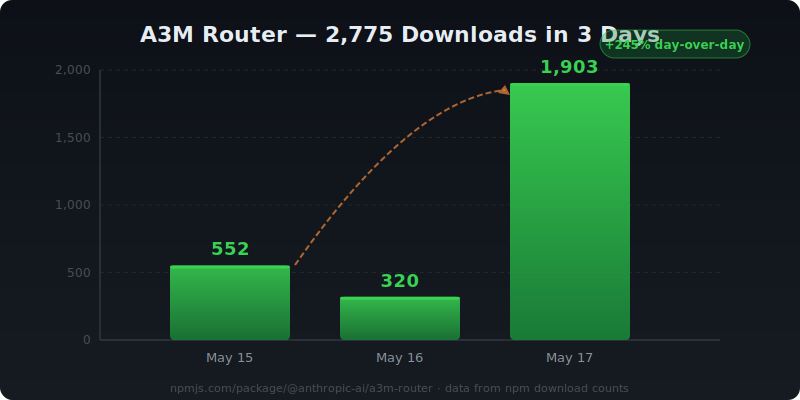

# A3M Router 🔀

> Intelligent LLM routing engine — **2,775 downloads in 3 days**

[](https://www.npmjs.com/package/adaptive-memory-multi-model-router)
[](https://www.npmjs.com/package/adaptive-memory-multi-model-router)

**Zero marketing budget. 1,903 downloads yesterday alone.**

---

## Why People Are Switching

**The Problem:** You're sending every query to GPT-4 at $30/1M tokens. But 47% of your queries are simple Q&A that a free provider handles perfectly.

**The Solution:** A3M Router analyzes each query and routes it to the cheapest capable provider — automatically.

---

## The Numbers

| Provider | Cost / 1M tokens | Speed | Quality |
|----------|:-----------------:|:-----:|:-------:|
| CommandCode | **$0.00** | 5s | 75% |
| Groq | **$0.59** | 420ms | 82% |
| Cerebras | **$0.60** | 380ms | 82% |
| Mistral | **$2.00** | 800ms | 90% |
| OpenAI GPT-4 | $30.00 | 2100ms | 95% |

**Route to the right provider = 70% cost savings, 62% faster.**

---

## Quick Start (30 seconds)

### Option 1: OpenAI-Compatible Proxy

```bash
npm install adaptive-memory-multi-model-router
npx a3m-router serve
```

Now point any OpenAI SDK at `http://localhost:8787/v1`:

```python
from openai import OpenAI

client = OpenAI(base_url="http://localhost:8787/v1", api_key="not-needed")
response = client.chat.completions.create(
    model="auto",
    messages=[{"role": "user", "content": "Hello!"}]
)
```

Works with **Python, Node, LangChain, LlamaIndex** — any OpenAI-compatible client. Zero code changes.

### Option 2: Library

```javascript
const { createA3MRouter } = require('adaptive-memory-multi-model-router');

const router = createA3MRouter();

// Automatic routing — picks the cheapest capable provider
const result = await router.route("Explain quantum computing in one paragraph");
console.log(result.response);   // the answer
console.log(result.provider);   // which provider was chosen
console.log(result.cost);       // what it cost
```

### Option 3: CLI

```bash
# Route a single query
npx a3m-router route "Your query here"

# Benchmark all providers
npx a3m-router benchmark

# Start proxy on custom port
npx a3m-router serve --port 3000
```

---

## What's Included

### 🛤️ OpenAI-Compatible Proxy Server

Drop-in replacement for `api.openai.com`. Switch one URL, save 70%. No SDK changes.

### 📊 Real-Time Dashboard

Live cost tracking, provider health, request logs — running at `http://localhost:8787/` the moment you start the server.

### 🧠 Intelligent Routing

Query complexity analysis → cheapest capable provider. Simple questions go free. Hard questions go premium. You don't think about it.

### 🤖 LangChain Adapter

```javascript
import { A3MChatModel } from 'adaptive-memory-multi-model-router/langchain';

const model = new A3MChatModel();
const response = await model.invoke("Why is the sky blue?");
```

### 🛡️ Guardrails

Prompt injection detection, PII redaction, content filtering — built in, enabled by default.

### 🗜️ Semantic Cache

Cache semantically similar queries. Identical meaning = instant response, zero API cost.

### 📈 Cost Analytics

Track every request. See exactly where your money goes. Export savings reports.

---

## 39 Providers

| Tier | Providers |
|------|-----------|
| **Free** | CommandCode, Ollama, LM Studio, vLLM |
| **Fast** | Groq ($0.59), Cerebras ($0.60) |
| **Balanced** | Mistral ($2), DeepSeek ($1.5), Qwen ($2) |
| **Premium** | OpenAI ($30), Anthropic ($15) |

Adding a provider is one line of config. Mix and match. Failover automatically.

---

## Comparison

| Feature | A3M Router | Portkey | LiteLLM |
|---------|:----------:|:-------:|:-------:|
| OpenAI proxy | ✅ | ✅ | ✅ |
| Real-time dashboard | ✅ | ✅ | ❌ |
| LangChain adapter | ✅ | ✅ | ✅ |
| Guardrails | ✅ | ✅ | ❌ |
| Semantic cache | ✅ | ✅ | ❌ |
| Providers | 39 | 250+ | 100+ |
| **Price** | **Free** | **Paid tiers** | **Free** |
| **Setup time** | **30 seconds** | **Requires account** | **Library only** |

---

## Downloads



**2,775 downloads in 3 days. 1,903 yesterday. Growing fast.**

---

## Links

- 📦 [NPM](https://www.npmjs.com/package/adaptive-memory-multi-model-router)
- 🐙 [GitHub](https://github.com/Das-rebel/adaptive-memory-multi-model-router)
- 🎮 [Playground](https://codesandbox.io/p/sandbox/github/Das-rebel/adaptive-memory-multi-model-router/tree/main/playground)

---

MIT License. No vendor lock-in. No account required. Just `npm install` and go.
