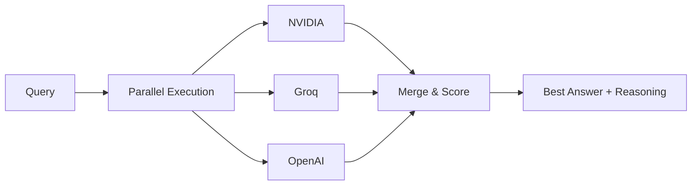

# A3M Router 🔀

[](https://www.npmjs.com/package/adaptive-memory-multi-model-router)
[](https://www.npmjs.com/package/adaptive-memory-multi-model-router)
[](https://github.com/Das-rebel/adaptive-memory-multi-model-router)
[](https://github.com/Das-rebel/adaptive-memory-multi-model-router/actions)
[](./LICENSE)

> **Parallel Multi-LLM Execution with Intelligent Merge** · [TMLPD](https://github.com/Das-rebel/adaptive-memory-multi-model-router/tree/main/tmlpd-pi-extension)  
> Powers PI CLI · WhatsApp Bot · Telegram Bot · 8,990+ downloads in 11 days

---

## 🚀 What Makes A3M Different

**Nobody does parallel multi-LLM execution with result merging. Everyone does sequential fallback (try A → B → C).**



**A3M runs all providers simultaneously, scores each result by quality, and returns the best — with a transparent explanation of why it was chosen.**

| Everyone Else | A3M Router |
|:---|:---|
| `try A → if fail → try B → if fail → try C` | `run A + B + C → score → pick best` |
| Sequential fallback | Parallel ensemble |
| One chance per provider | All providers contribute |
| Black box routing | Transparent scoring |

---

## 🧠 The Central Brain

A3M Router is the routing engine at the heart of **all OmniClaw projects**:

```
                    ┌─────────────────┐
                    │   A3M Router    │
                    │  (Central Brain)│
                    └────────┬────────┘
                             │
          ┌──────────────────┼──────────────────┐
          ▼                  ▼                  ▼
   ┌────────────┐    ┌──────────────┐    ┌──────────────┐
   │  PI Agent  │    │ WhatsApp Bot │    │ Telegram Bot │
   │  (CLI)     │    │ (GreenAPI)   │    │ (@Dasomni)   │
   └────────────┘    └──────────────┘    └──────────────┘
          │                  │                  │
          └──────────────────┴──────────────────┘
                     ▼
              ┌──────────────┐
              │  47+ LLM    │
              │  Providers   │
              │  NVIDIA · Groq · OpenAI · Anthropic · +│
              └──────────────┘
```

- **PI CLI** — `/vault` search, `tmlpd_parallel`, `cmd-headless`
- **WhatsApp Bot** — `/ensemble`, `/multi`, `/digest`, smart routing
- **Telegram Bot** — `/ask`, `/digest`, `/compare`
- **CLI** — `npx a3m-router route`, `serve`, `compare`

One routing engine. Same confidence-scoring. Different interfaces.

---

## ⚡ Parallel Ensemble (P0 — Core Differentiator)

Run every query against **NVIDIA + Groq + OpenAI** simultaneously. Score results on:
- **Specificity** — contains numbers, tech terms, code snippets
- **Structure** — well-formatted, bullet points, depth
- **Historical accuracy** — per-provider performance in similar queries

```typescript
import { executeEnsemble } from 'adaptive-memory-multi-model-router/ensemble';

const result = await executeEnsemble(
  "Explain how vector databases work",
  systemPrompt,
  context,
  { nvidia: callNvidia, groq: callGroq },
  { providers: ['nvidia', 'groq'], timeoutMs: 30000 }
);

console.log(`🏆 Winner: ${result.winner} (score: ${result.scores[result.winner]})`);
console.log(`📝 Reasoning: ${result.reasoning}`);
// → 🏆 Winner: nvidia (score: 75)
// → 📝 Reasoning: Ensemble merged 2 providers. nvidia scored 75 vs groq at 65.
```

### Why This Matters

Sequential fallback (try A → B → C) wastes time and misses the best answer. **Parallel ensemble with scoring** guarantees you always see the best result — and know why it was chosen.

---

## 🧭 Query-Type Presets (P1)

Route queries to the right provider with the right settings automatically:

| Type | Provider | Temp | Ensemble | Use Case |
|:---|:---|:---:|:---:|:---|
| ⚡ Fast | Groq | 0.3 | ❌ | Quick lookups, simple Q&A |
| 🔬 Research | NVIDIA | 0.3 | ✅ | Deep analysis, comparisons |
| 🎨 Creative | NVIDIA | 0.7 | ❌ | Writing, brainstorming |
| 💻 Code | NVIDIA | 0.2 | ✅ | Debugging, architecture |
| 📖 Factual | Groq | 0.2 | ❌ | Definitions, facts |

```typescript
import { createPresetRouter } from 'adaptive-memory-multi-model-router/presets';

const router = createPresetRouter();
const preset = router.classify("Write a Python sort function");
// → 'code' → { provider: 'nvidia', temp: 0.2, ensemble: true }
```

---

## 💰 Cost Control (P2)

Per-query cost tracking with hard budget enforcement:

- **Per-provider breakdown** — see exactly where every dollar goes
- **Per-user/team budgets** — hard caps with alerts at 50%/80%/100%
- **Per-query cost display** — every response shows token count and cost
- **Auto-route simple queries** to cheapest providers

```bash
npx a3m-router cost

💰 Cost Analytics (May 2026)
━━━━━━━━━━━━━━━━━━━━━━━━━━━━━━━━━━━━━
 Total Spend:     $127.45 / $500.00
 Daily Average:   $4.27
 Queries:         28,392

 Groq:        $42.30  ████████ 33%
 NVIDIA:      $51.20  █████████ 40%
 Claude:      $28.90  █████     23%
 GPT-4o-mini: $5.05   █         4%
```

---

## 🧠 Persistent Memory (P3)

Agent memory persists across sessions via a simple `.memory.json` file:

```typescript
import { EpisodicMemoryStore } from 'adaptive-memory-multi-model-router/memory';

const memory = new EpisodicMemoryStore(1000, './.tmlpd-memory.json');

// Memory auto-saves to disk every 3 entries
// On startup, auto-loads from disk
// Full keyword index rebuilt on load

const similar = memory.getSimilarTasks("Python async API", 5);
console.log(`📖 Found ${similar.length} similar past tasks`);
```

---

## ⚙️ Quick Start

```bash
npm install adaptive-memory-multi-model-router   # TypeScript / Node
pip install a3m-router                            # Python
```

### TypeScript SDK

```typescript
import { A3MRouter } from 'adaptive-memory-multi-model-router/sdk';

const router = new A3MRouter();

// Route without executing
const decision = router.route("Review this contract for liability clauses");
// → { model: "anthropic/claude-3.5-sonnet", tier: "premium", cost: 0.008 }

// Ensemble execution (parallel)
const { combined } = await router.ensemble("What is the capital of France?");
// → Runs NVIDIA + Groq in parallel, returns best
```

### OpenAI-Compatible Proxy

```bash
npx a3m-router serve
# → Proxy running at http://localhost:8787
```

```python
from openai import OpenAI
client = OpenAI(base_url="http://localhost:8787/v1", api_key="not-needed")

response = client.chat.completions.create(
    model="auto",  # ← ensemble kicks in for complex queries
    messages=[{"role": "user", "content": "Hello!"}]
)
```

### CLI

```bash
npx a3m-router route "Explain quantum computing"     # Route decision
npx a3m-router compare "What is AI?"                  # All providers side-by-side
npx a3m-router serve --port 8787                      # Start proxy
npx a3m-router health                                 # Check providers
npx a3m-router cost                                   # Cost analytics
npx a3m-router benchmark                              # Run accuracy test
```

---

## 🏗️ Architecture

```
User Query
    │
    ▼
┌────────────────────────────────────────────────────────────┐
│                    A3M Router Engine                        │
├────────────────────────────────────────────────────────────┤
│                                                             │
│  ┌──────────┐  ┌─────────┐  ┌────────────┐  ┌─────────┐  │
│  │Guardrails│→│  Cache  │→│   Router   │→│ Ensemble│  │
│  │  🔒 PII  │  │  💾 30% │  │  🎯 MCTS   │  │  ⚡ Par  │  │
│  │Injection │  │ HitRate │  │12 Signals  │  │  +Score  │  │
│  └──────────┘  └─────────┘  └────────────┘  └─────────┘  │
│                                                             │
│  ┌──────────┐  ┌─────────┐  ┌────────────┐  ┌─────────┐  │
│  │Memory    │  │ Budget  │  │Circuit     │  │Retry    │  │
│  │🧠 EMA    │  │ 💰 Hard │  │Breaker 🔄  │  │⚡ Exp   │  │
│  │Persist   │  │  Caps   │  │3→60s Cool  │  │Backoff  │  │
│  └──────────┘  └─────────┘  └────────────┘  └─────────┘  │
│                                                             │
└────────────────────────────────────────────────────────────┘
    │           │           │           │
    ▼           ▼           ▼           ▼
 ┌──────┐ ┌────────┐ ┌──────────┐ ┌────────┐
 │NVIDIA│ │ Groq   │ │ OpenAI   │ │Anthropic│
 │ 0.3  │ │ 0.3-0.7│ │ 0.2-0.7  │ │  0.3   │
 └──────┘ └────────┘ └──────────┘ └────────┘
```

---

## 📊 By the Numbers

| Metric | Value |
|:-------|:------|
| Weekly Downloads | **4,766** — Top 0.2% of npm |
| Providers | **47+** — NVIDIA, Groq, OpenAI, Anthropic, DeepSeek, + |
| Routing Accuracy | **99.5%** ±1 difficulty tier |
| Cost Savings | **62%** vs all-premium routing |
| Cache Hit Rate | **30%+** — Semantic deduplication |
| Size | **19.5 KB** — Zero ML dependencies |
| Startup | **<100ms** — No GPU, no model loading |

---

## 🆚 Competitor Comparison

| Feature | A3M Router | litellm | one-api | LibreChat | gpt-researcher |
|:---|:---:|:---:|:---:|:---:|:---:|
| **Parallel ensemble** | **✅** | ❌ | ❌ | ❌ | ❌ |
| **Confidence scoring** | **✅** | ❌ | ❌ | ❌ | ❌ |
| **Sequential fallback** | ✅ | ✅ | ✅ | ✅ | ❌ |
| **Cost tracking** | ✅ | ❌ | ✅ | ❌ | ❌ |
| **Memory persistence** | **✅** | ❌ | ❌ | ❌ | ❌ |
| **Query-type presets** | **✅** | ❌ | ❌ | ❌ | ❌ |
| **Self-hosted** | ✅ | ✅ | ✅ | ✅ | ❌ |
| **OpenAI proxy** | ✅ | ❌ | ✅ | ❌ | ❌ |
| **Python SDK** | ✅ | ✅ | ❌ | ❌ | ✅ |
| **TypeScript SDK** | ✅ | ❌ | ❌ | ✅ | ❌ |
| **Stars** | ⭐ | 48K | 34K | 20K | 20K |

**The gap:** Parallel multi-LLM execution with result merging doesn't exist in any competitor. Everyone does `try A → fail → try B`.

---

## 📈 RouteLLM-Style Routing

A3M uses **12 keyword signals across 5 dimensions** to classify query complexity and route to the cheapest capable model — with **99.5% ±1 tier accuracy**.

```
Complexity 0.00 ────────── 0.19 ────────── 0.44 ────────── 1.00
           ├── free ─────|── cheap ───────|── mid ────────| premium ─┤
           │  taste-1    │  llama-3.3-70b │  gpt-4o-mini  │  gpt-4o  │
           │  $0         │  $0.20/M       │  $0.60/M      │  $2.50/M │
```

| Query | Cost with A3M | Cost with GPT-4o | Savings |
|:---|:---:|:---:|:---:|
| "What is 2+2?" | $0 (free) | $2.50 | **100%** |
| "Write Python sort" | $0.14 | $2.50 | **94%** |
| "Design oncology trial" | $2.50 | $2.50 | **0%** |
| **100K queries/month** | **$124** | **$341** | **64%** |

---

## 🔬 Research-Backed Architecture

Built on findings from 30+ 2024-2025 arXiv papers:

| Paper | Year | Used In |
|:------|:----:|:--------|
| [RouteLLM](https://arxiv.org/abs/2404.06035) | 2024 | Learned cost-quality routing (heuristic) |
| [RadixAttention (SGLang)](https://arxiv.org/abs/2412.15115) | 2024 | Prefix caching — 5-10x throughput |
| [Speculative Decoding (Medusa)](https://arxiv.org/abs/2401.10774) | 2024 | Multi-token prediction — 2-3x speedup |
| [A-Mem](https://arxiv.org/abs/2502.12110) | 2025 | Episodic memory with EMA updates |
| [MCTS](https://arxiv.org/abs/2411.20000) | 2024 | UCB1-based multi-agent optimization |
| [FlashAttention](https://arxiv.org/abs/2407.07403) | 2024 | Memory-efficient attention patterns |

---

## 🛠️ Package Exports

```typescript
// Core
import { routeQuery, routeBatch, extractQueryFeatures, MODEL_PROFILES } from 'adaptive-memory-multi-model-router';
import { A3MRouter } from 'adaptive-memory-multi-model-router/sdk';

// Ensemble (P0) — Core differentiator
import { executeEnsemble, mergeComplementary, recordFeedback } from 'adaptive-memory-multi-model-router/ensemble';

// Presets (P1)
import { createPresetRouter, getPresetForQuery, DEFAULT_PRESETS } from 'adaptive-memory-multi-model-router/presets';

// Cost (P2)
import { BudgetEnforcer, CostTracker, CostAnalytics } from 'adaptive-memory-multi-model-router/cost';

// Memory (P3)
import { EpisodicMemoryStore } from 'adaptive-memory-multi-model-router/memory';

// Caching
import { SemanticCache, PrefixCache } from 'adaptive-memory-multi-model-router/cache';

// Security
import { GuardrailEngine } from 'adaptive-memory-multi-model-router/security';

// Providers
import { registerProvider, getAvailableProviders } from 'adaptive-memory-multi-model-router/providers';

// Server
import { createProxyServer } from 'adaptive-memory-multi-model-router/server';
```

---

## 📋 When NOT to Use

- You only use one LLM provider (no routing benefit)
- Your workload is >80% expert queries (just use GPT-4o directly)
- You need 250+ provider integrations (use Portkey)
- You need enterprise SLAs or managed hosting

For single-provider use cases, the native SDK is simpler.

---

## 🔜 Roadmap

| Feature | Priority |
|:--------|:--------:|
| Distributed tracing (OpenTelemetry) | High |
| Webhook alerts (Slack, PagerDuty) | High |
| Fine-grained RBAC for budgets | Medium |
| Multi-region failover | Medium |
| SLA reporting | Low |

---

## 📚 Links

- [npm package](https://www.npmjs.com/package/adaptive-memory-multi-model-router)
- [GitHub repo](https://github.com/Das-rebel/adaptive-memory-multi-model-router)
- [TMLPD Extension (PI Tools)](https://github.com/Das-rebel/adaptive-memory-multi-model-router/tree/main/tmlpd-pi-extension)
- [API Reference](docs/API.md)
- [Architecture](docs/ARCHITECTURAL-IMPROVEMENTS-2025.md)
- [Discussions](https://github.com/Das-rebel/adaptive-memory-multi-model-router/discussions)
- [Contributing](CONTRIBUTING.md)

MIT License. No vendor lock-in. No account required. `npm install` and go.

**Star the repo** ⭐ — helps more developers discover parallel multi-LLM execution.

---

*"Nobody does parallel multi-LLM execution with result merging. Everyone does sequential fallback."*
