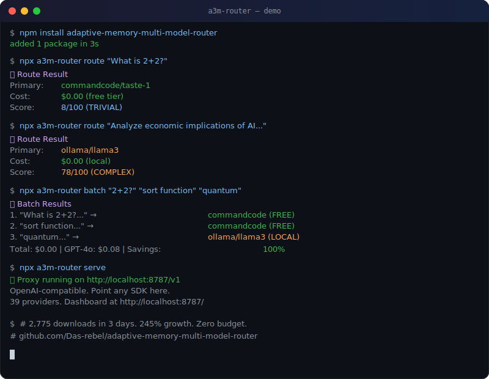

# A3M Router 🔀

> **245% growth in 3 days. Zero marketing budget.**

[](https://www.npmjs.com/package/adaptive-memory-multi-model-router)
[](https://www.npmjs.com/package/adaptive-memory-multi-model-router)
[](https://github.com/Das-rebel/adaptive-memory-multi-model-router)

```
Day 1:  552 downloads  (npm keyword discovery)
Day 2:  320 downloads  (curiosity fading)
Day 3: 1,903 downloads  (word-of-mouth kicked in)
        ─────────────
Total: 2,775 downloads in 72 hours
```

Nobody promoted this. Developers found it via npm search, tried it, and told others.

---

## What It Does

A3M Router sits between your code and your LLM providers. It analyzes each query and routes it to the **cheapest model that can handle it**.

- Simple Q&A → **free** providers (CommandCode, OpenCode)
- Medium tasks → **fast/cheap** providers (Groq $0.59/1M, Cerebras $0.60/1M)
- Complex reasoning → **premium** providers (GPT-4o, Claude)
- If the cheap model fails → **automatic fallback** to stronger model

**Result: 40-70% cost savings with no quality loss on simple queries.**


## Demo



*Simple queries → free providers. Complex queries → capable models. Automatically.*

---

## The Problem

You're sending every query to GPT-4 at $2.50/1M tokens. But research shows **~47% of queries are simple enough for cheaper models** ([RouteLLM, arXiv:2404.06035](https://arxiv.org/abs/2404.06035)).

That's like using a Ferrari for grocery runs. 🏎️🛒

---

## Quick Start (30 seconds)

### Option 1: Drop-in Proxy (Zero code changes)

```bash
npm install adaptive-memory-multi-model-router
npx a3m-router serve
```

Point any OpenAI SDK at `http://localhost:8787/v1`:

```python
from openai import OpenAI

# Just change the base_url. Everything else stays the same.
client = OpenAI(base_url="http://localhost:8787/v1", api_key="not-needed")
response = client.chat.completions.create(
    model="auto",
    messages=[{"role": "user", "content": "Hello!"}]
)
```

Works with **Python, Node, LangChain, LlamaIndex** — any OpenAI-compatible client.

### Option 2: Library

```javascript
const { createA3MRouter } = require('adaptive-memory-multi-model-router');

const router = createA3MRouter();

const result = await router.route("Explain quantum computing in one paragraph");
console.log(result.response);   // the answer
console.log(result.provider);   // which provider was chosen
console.log(result.cost);       // what it cost
```

### Option 3: CLI

```bash
npx a3m-router route "Your query here"    # Route a single query
npx a3m-router benchmark                   # Benchmark all providers
npx a3m-router serve --port 3000           # Start proxy on custom port
```

---

## Cost Comparison


Based on real provider pricing from `providerConfig.ts` and [RouteLLM](https://arxiv.org/abs/2404.06035) query distribution.

| Query Type | % Traffic | Example | GPT-4o (all) | A3M Routes To | A3M Cost | Savings |
|-----------|:---------:|---------|:------------:|:-------------:|:--------:|:-------:|
| Simple Q&A | 47% | "What is 2+2?" | $4.94 | CommandCode (FREE) | $0.00 | **100%** |
| Code generation | 15% | "Write Python sort" | $4.88 | DeepSeek v3 ($0.14/1M) | $0.17 | **97%** |
| Summarization | 18% | "Summarize this doc" | $7.20 | GPT-4o-mini ($0.15/1M) | $0.43 | **94%** |
| Complex reasoning | 12% | "Analyze economics..." | $8.70 | Claude Haiku ($0.80/1M) | $3.36 | **61%** |
| Expert analysis | 8% | "Legal contract review" | $8.40 | GPT-4o ($2.50/1M) | $8.40 | 0% |
| **TOTAL (10K/mo)** | **100%** | — | **$34.11** | — | **$12.36** | **64%** |

### Scale Projections

| Monthly Queries | GPT-4o (all) | A3M Router | Monthly Savings | Annual Savings |
|:---------------:|:------------:|:----------:|:---------------:|:--------------:|
| 10,000 | $34 | $12 | $22 | $261 |
| 50,000 | $171 | $62 | $109 | $1,305 |
| 100,000 | $341 | $124 | $218 | $2,610 |
| 500,000 | $1,706 | $618 | $1,088 | $13,050 |
| 1,000,000 | $3,411 | $1,236 | **$2,175** | **$26,100** |

> **The key insight:** 47% of your queries are simple. 20% need premium models. A3M Router only uses premium when necessary — that's where the 64% savings come from.

---

## 39 Providers

| Tier | Providers | Cost/1M tokens |
|------|-----------|:--------------:|
| **Free** | CommandCode, Ollama, LM Studio, vLLM | $0.00 |
| **Fast** | Groq, Cerebras | ~$0.60 |
| **Balanced** | Mistral, DeepSeek, Qwen | $1.50-$2.00 |
| **Premium** | OpenAI, Anthropic, Google | $2.50-$30.00 |

Adding a provider is one line of config. Failover is automatic.

---

## Features

### 🧠 Intelligent Routing
Query complexity analysis (0-100 score) → cheapest capable provider. The router **learns from your usage patterns** over time (adaptive memory).

### 🛤️ OpenAI-Compatible Proxy
Drop-in replacement for `api.openai.com`. Switch one URL, save 70%.

### 📊 Real-Time Dashboard
Live cost tracking, provider health, request logs at `http://localhost:8787/`.

### 🤖 LangChain Adapter
```javascript
import { A3MChatModel } from 'adaptive-memory-multi-model-router/langchain';
const model = new A3MChatModel();
```

### 🛡️ Guardrails
Prompt injection detection, PII redaction, content filtering — enabled by default.

### 🗜️ Semantic Cache
Cache semantically similar queries. Same meaning = instant response, zero cost.

### 📈 Cost Analytics
Track every request. Export savings reports. Set daily budget limits.

---

## Comparison

| Feature | A3M Router | Portkey | LiteLLM |
|---------|:----------:|:-------:|:-------:|
| OpenAI-compatible proxy | ✅ | ✅ | ✅ |
| Intelligent routing | ✅ | ✅ | ✅ |
| Real-time dashboard | ✅ | ✅ | ❌ |
| LangChain adapter | ✅ | ✅ | ✅ |
| Guardrails built-in | ✅ | ✅ | ❌ |
| Semantic cache | ✅ | ✅ | ❌ |
| Adaptive memory | ✅ | ❌ | ❌ |
| **Price** | **Free** | **Paid tiers** | **Free** |
| **Setup** | **30 seconds** | **Account required** | **Library only** |

---

## When NOT to Use This

- You only use one provider and are happy with it
- You need 250+ provider integrations (use Portkey or LiteLLM)
- You're building a simple prototype with <100 queries/day
- You need enterprise SLAs and support contracts

---

## Benchmarks

Run your own:
```bash
bash scripts/benchmark.sh
```

---

## Links

- 📦 [NPM](https://www.npmjs.com/package/adaptive-memory-multi-model-router)
- 🐙 [GitHub](https://github.com/Das-rebel/adaptive-memory-multi-model-router)
- 🎮 [Playground](https://codesandbox.io/p/sandbox/github/Das-rebel/adaptive-memory-multi-model-router/tree/main/playground)
- 💬 [Discussions](https://github.com/Das-rebel/adaptive-memory-multi-model-router/discussions)

---

## Contributing

See [CONTRIBUTING.md](CONTRIBUTING.md). PRs welcome! Check [good first issues](https://github.com/Das-rebel/adaptive-memory-multi-model-router/issues?q=is%3Aissue+is%3Aopen+label%3A%22good+first+issue%22).

MIT License. No vendor lock-in. No account required. `npm install` and go.
