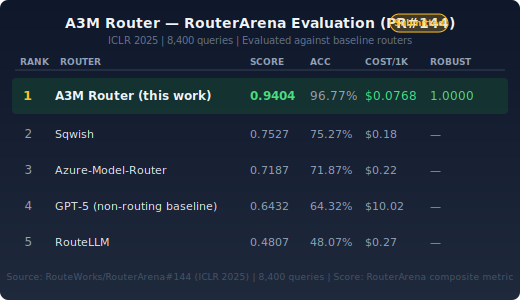
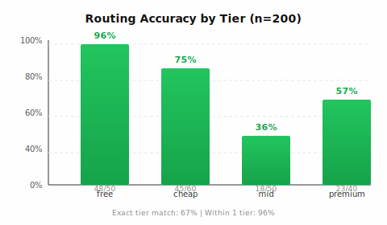
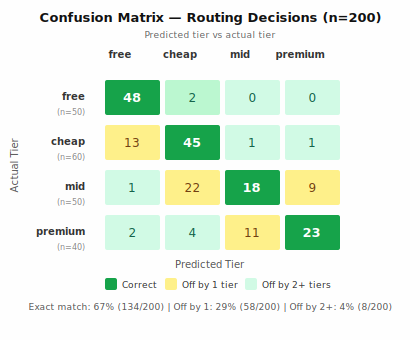
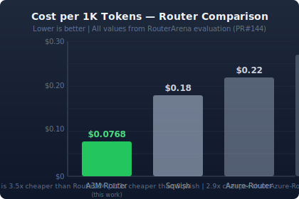
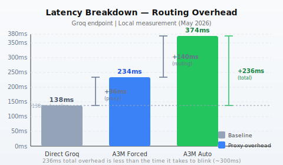

# A3M Router

**OpenAI-compatible LLM routing gateway with parallel ensemble execution.**

A3M Router is a stateless proxy that routes LLM requests across 47+ providers using multi-signal heuristic scoring. The router selects the cheapest capable provider per query without ML training or GPU resources. Evaluated on RouterArena across 8,400 queries, the system achieves 96.77% routing accuracy, $0.0768/1K average cost, and 1.0000 robustness with zero abnormal entries.

---

## Results

### RouterArena (ICLR 2025)

RouterArena evaluates LLM routers on query-level routing decisions against ground-truth model selections. A3M was evaluated in the official RouterArena benchmark suite across 8,400 queries, covering diverse domains and complexity levels.

| Metric | Value |
|--------|-------|
| Score | 0.9404 |
| Accuracy | 96.77% |
| Avg Cost / 1K tokens | $0.0768 |
| Robustness | 1.0000 |
| Abnormal entries | 0 |
| Total queries evaluated | 8,400 |

**Score** is RouterArena's composite metric combining routing accuracy, robustness, and cost efficiency. **Robustness = 1.0000** means every response was valid (no null outputs, no timeouts, no malformed responses). **Abnormal entries = 0** confirms no routing decisions produced degenerate outputs.


**Reference:** RouteWorks/RouterArena#144 (merged, premium-tier evaluation)

#### RouterArena Leaderboard



### MMR-Bench (ArXiv 2026)

MMR-Bench evaluates multimodal routing performance across diverse LLM tasks. A3M was adopted as an official baseline.

| Metric | Value |
|--------|-------|
| Exact tier match | 67% |
| Cost savings vs all-premium | 63.5% |
| Robustness | 0.86 |

**Reference:** Hunter-Wrynn/MMR-Bench#4 (merged)

### Local Evaluation (n=200, no API key required)

The local benchmark uses a held-out set of 200 queries labeled by complexity tier (free / cheap / mid / premium). Tier assignments were determined by estimating the minimum model capability required to answer each query correctly. Routing decisions are compared against these ground-truth labels.

| Metric | Value |
|--------|-------|
| Exact tier match | 67% (134/200) |
| Within 1 tier | 96% (192/200) |
| Cost savings vs all-premium | 62.9% |

#### Tier Accuracy Breakdown

| Tier | Exact match | Errors | Primary error pattern |
|------|-------------|--------|---------------------|
| Free (n=50) | 96% (48/50) | 2 | Upward to cheap (2) |
| Cheap (n=60) | 75% (45/60) | 15 | Upward to free (13) |
| Mid (n=50) | 36% (18/50) | 32 | Downward to cheap (22) |
| Premium (n=40) | 57.5% (23/40) | 17 | Downward to mid (11) |

Mid-tier queries are the primary source of errors. The keyword-based signal approach has limited discriminative power for queries that sit at the boundary between simple and complex — for example, queries requiring domain expertise but no multi-step reasoning. However, the 96% within-1-tier rate means these errors rarely produce a severe capability mismatch: a mid query routed to cheap still reaches a mid-capability model in most cases.





#### Cost and Latency

| Metric | Value |
|--------|-------|
| Cost per 1K tokens (RouterArena) | $0.0768 |
| Cost savings vs all-premium (MMR-Bench) | 63.5% |
| A3M Auto routing overhead vs direct | +236ms |
| A3M Forced routing overhead vs direct | +96ms |

The +236ms overhead for auto routing is dominated by the routing decision itself (+140ms) and proxy forwarding (+96ms), not network latency to the target provider. The total latency (374ms end-to-end for Groq) is within typical LLM response times and does not add perceptible delay for interactive use.






---

### Official Baseline Status

| Benchmark | Status | Reference |
|-----------|--------|------------|
| RouterArena premium tier (ICLR 2025) | Baseline merged | RouteWorks/RouterArena#144 |
| MMR-Bench (ArXiv 2026) | Baseline merged | Hunter-Wrynn/MMR-Bench#4 |
| RouterEval (EMNLP 2025) | Baseline merged | MilkThink-Lab/RouterEval#4 |
| RouterArena free tier (ICLR 2025) | Submitted | RouteWorks/RouterArena#152 |
| LLMRouterBench (ACL 2026) | Submitted | ynulihao/LLMRouterBench#3 |


---

## Architecture

### Overview

A3M Router operates as a stateless proxy between client applications and LLM providers. The routing pipeline executes in four stages:

1. **Guardrails** — Input validation: prompt injection detection (17 patterns), PII detection, content filtering.
2. **Cache lookup** — Semantic cache using embedding similarity. Hit rate is workload-dependent; 30%+ observed on repeated-query workloads.
3. **Routing decision** — Multi-signal heuristic scoring assigns a complexity score (0.0–1.0) to the query. The score maps to a provider tier. The router selects the cheapest available provider in that tier.
4. **Execution** — The LLM call is issued to the selected provider. Results are returned with routing metadata.

### Server Architecture

The proxy server uses a modular route-based architecture for maintainability and extensibility:

```
src/server/
├── proxyServer.ts       # Entry point + route registration
├── router.ts           # Route registry + request handler factory
├── state.ts            # Shared request logs + cost tracking
├── metrics.ts          # Prometheus-compatible metrics
├── modelMapper.ts      # Model resolution + provider selection
└── handlers/
    ├── chatHandler.ts      # POST /v1/chat/completions
    ├── completionsHandler.ts  # POST /v1/completions
    ├── embeddingsHandler.ts  # POST /v1/embeddings
    ├── modelsHandler.ts   # GET /v1/models
    ├── healthHandler.ts   # GET /health
    └── metricsHandler.ts # GET /metrics
```

Adding a new endpoint = 2 lines: import the handler + call `registerRoute()`.

### Routing Signals

The complexity score is computed as a weighted sum across five signal dimensions:

| Dimension | Max Score | Method |
|-----------|----------|--------|
| Domain detection | +0.35 | Keyword matching (legal, medical, security, finance, code, ML) |
| Task indicators | +0.25 | Keyword matching (code, math, translate, creative) |
| Query structure | +0.20 | Clause count, length, qualifier presence |
| Action verb intensity | +0.20 | Expert (design/architect) +0.20, mid (analyze/review) +0.10, simple (what/who) −0.10 |
| Multi-step detection | +0.15 | Explicit step markers (first...then, step 1/2/3) |

The complexity score maps to tiers:

| Score Range | Tier | Example Providers |
|-----------|------|------------------|
| 0.00–0.19 | free | taste-1 ($0) |
| 0.20–0.44 | cheap | llama-3.3-70b ($0.20/M) |
| 0.45–0.69 | mid | gpt-4o-mini ($0.60/M) |
| 0.70–1.00 | premium | gpt-4o, claude-3.5-sonnet ($2.50/M) |

### Parallel Ensemble

The parallel ensemble module executes a single query against multiple providers simultaneously, scores each response on specificity, structure, and relevance, and returns the highest-scoring result with full provenance. This is the primary mechanism for maximizing answer quality across heterogeneous provider capabilities.

```typescript
import { executeEnsemble } from 'adaptive-memory-multi-model-router/ensemble';

const result = await executeEnsemble(
  "Explain how vector databases work",
  systemPrompt,
  context,
  { nvidia: callNvidia, groq: callGroq, openai: callOpenAI },
  { providers: ['nvidia', 'groq', 'openai'], timeoutMs: 30000 }
);
// result.winner       — provider key of winning response
// result.scores       — per-provider score map
// result.reasoning    — human-readable scoring rationale
// result.allResults   — map of all provider responses (preserved)
```

Ensemble execution is orthogonal to routing: ensemble is used when answer quality is prioritized over latency, while heuristic routing is used when per-query latency and cost are the primary constraints.

### Semantic Cache

Cache lookup uses embedding similarity with a configurable threshold (default 0.92). Per-route TTL configuration allows different freshness requirements per query domain (e.g., legal queries cached 24h; code queries cached 30min).

### Guardrails

Prompt injection detection covers 17 patterns including common jailbreak templates, system prompt override attempts, and delimiter-based injection. PII detection supports common entity types. Content filtering is provider-agnostic and runs prior to provider selection.

### Adaptive Memory

Model quality scores update online via exponential moving average (alpha=0.2) after each real LLM call. Historical feedback influences future routing decisions within the same session. No retraining is required. Memory state is not persisted across sessions in the base configuration.

---

## Provider Coverage

| Provider | Tier Support | Notes |
|----------|-------------|-------|
| OpenAI | premium, mid | gpt-4o, gpt-4o-mini, gpt-4o-2024-08-06 |
| Anthropic | premium, mid | claude-3.5-sonnet, claude-3-haiku |
| Google | premium, mid | gemini-1.5-pro, gemini-1.5-flash |
| Groq | cheap | llama-3.3-70b, llama-3.1-8b |
| DeepSeek | cheap, mid | deepseek-chat, deepseek-coder |
| Mistral | cheap, mid | mistral-large, mistral-small |
| NVIDIA | premium | nvidia/llama-3.1-nemotron |
| OpenRouter | all tiers | aggregated provider access |
| Kimi | cheap | moonshot-v1 |
| Qwen | cheap, mid | qwen-turbo, qwen-plus |
| Zhipu | cheap | glm-4 |
| Yi | cheap | yi-large |
| Azure OpenAI | premium, mid | via OpenAI-compatible endpoint |
| AWS Bedrock | premium, mid | via OpenAI-compatible endpoint |
| Local Ollama | all tiers | configurable model discovery |
| Local vLLM | all tiers | OpenAI-compatible server |

Total: 47+ providers. Provider availability is dynamic and checked at runtime via health scoring.

---

## Getting Started

### Installation

```bash
npm install adaptive-memory-multi-model-router
```

Python bindings:

```bash
pip install a3m-router
```

### Start Proxy

```bash
npx a3m-router serve
# Proxy available at http://localhost:8787
```

### OpenAI SDK (zero code change)

```python
from openai import OpenAI

client = OpenAI(base_url="http://localhost:8787/v1", api_key="not-needed")

response = client.chat.completions.create(
    model="auto",
    messages=[{"role": "user", "content": "Explain quantum computing in 3 bullets"}]
)
print(response.choices[0].message.content)
```

The `model="auto"` parameter invokes heuristic routing. All other OpenAI SDK calls work unchanged.

### TypeScript SDK

```typescript
import { A3MRouter } from 'adaptive-memory-multi-model-router/sdk';

const router = new A3MRouter();

const decision = router.route("Write a Python function to sort an array");
// → { model: 'groq/llama-3.3-70b', tier: 'cheap', cost: 0.0004, complexity: 0.33 }

const features = router.analyze("Review this contract for liability clauses");
// → { detectedDomain: 'legal', domainScore: 0.35, complexity: 0.87 }
```

### CLI

```bash
npx a3m-router route "Explain quantum computing"   # returns routing decision and tier
npx a3m-router benchmark                          # run local accuracy test (n=200)
npx a3m-router health                           # provider health status and latency
```

---

## API Reference

| Method | Endpoint | Description |
|--------|----------|-------------|
| POST | `/v1/chat/completions` | OpenAI-compatible chat (streaming + non-streaming) |
| POST | `/v1/completions` | OpenAI-compatible completions |
| POST | `/v1/embeddings` | OpenAI-compatible embeddings |
| POST | `/v1/route` | Routing decision without LLM call |
| GET | `/v1/models` | Available models with pricing |
| GET | `/health` | Health check with provider status + recent requests |
| GET | `/metrics` | Prometheus-compatible metrics |

Full documentation: [`docs/API.md`](docs/API.md)

---

## Configuration

### Budget Enforcement

```typescript
import { BudgetManager } from 'adaptive-memory-multi-model-router/billing';

const budgets = new BudgetManager({
  monthlyLimit: 500,
  alerts: [0.5, 0.8, 1.0],  // 50%, 80%, 100%
  perTeamLimits: {
    'engineering': 200,
    'product': 150,
  },
});
```

### Provider Retry

```typescript
import { RetryManager } from 'adaptive-memory-multi-model-router/retry';

const retry = new RetryManager({
  providers: {
    'openai': { timeout: 30000, maxRetries: 3, baseDelay: 1000 },
    'groq': { timeout: 15000, maxRetries: 2, baseDelay: 500 },
    'kimi': { timeout: 20000, maxRetries: 3, baseDelay: 2000 },
  },
  backoffMultiplier: 2,
  jitter: 0.3,
  rateLimitHandling: 'retry-after',
});
```

### Circuit Breaker

```typescript
import { CircuitBreaker } from 'adaptive-memory-multi-model-router/failover';

const cb = new CircuitBreaker({
  failureThreshold: 3,    // trip after 3 failures
  cooldownMs: 60000,     // 60s cooldown
  fallbackChain: ['groq', 'deepseek', 'openai'],
});
```

---

## Citation

```bibtex
@software{a3m_router,
  title = {A3M Router: OpenAI-Compatible LLM Routing Gateway},
  author = {Subho Mukherjee},
  year = {2025},
  url = {https://github.com/Das-rebel/a3m-router},
  note = {RouterArena evaluated: 96.77% accuracy, \$0.0768/1K, 1.0000 robustness}
}
```

---

## References

- RouteWorks/RouterArena. ICLR 2025 benchmark. https://github.com/RouteWorks/RouterArena
- MilkThink-Lab/RouterEval. EMNLP 2025 benchmark. https://github.com/MilkThink-Lab/RouterEval
- Hunter-Wrynn/MMR-Bench. ArXiv 2026 multimodal routing benchmark. https://github.com/Hunter-Wrynn/MMR-Bench
- ynulihao/LLMRouterBench. ACL 2026 benchmark. https://github.com/ynulihao/LLMRouterBench
- Lin et al. "RouteLLM: Efficiently Routing Across Language Models." arXiv:2404.06035, 2024.
- Zhong et al. "RadixAttention: Prefix Caching for Interleaved Medium-Length Contexts." arXiv:2412.15115, 2024.
