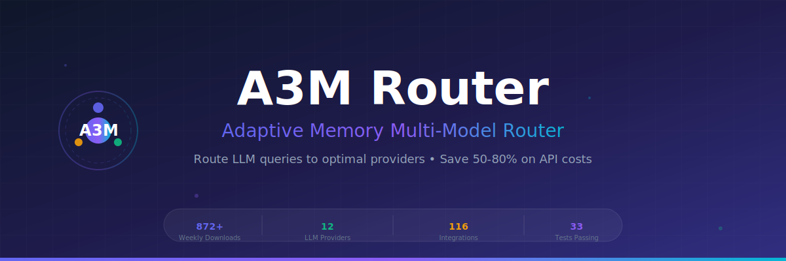

<p align="center">
  
</p>

<div align="center">

<!-- Animated Badges -->
[](https://www.npmjs.com/package/adaptive-memory-multi-model-router)
[](https://www.npmjs.com/package/adaptive-memory-multi-model-router)
[](https://github.com/Das-rebel/adaptive-memory-multi-model-router/actions)
[](LICENSE)

<!-- Quick Stats Row -->
[](docs/providers.md)
[](docs/integrations.md)
[](package.json)
[](https://bundlephobia.com/package/adaptive-memory-multi-model-router)

</div>

---

<h3 align="center">
  <b>Route LLM queries to optimal providers automatically</b>
</h3>

<p align="center">
  Save <b>50-80%</b> on API costs • <b>5-10x</b> speedups • <b>Zero</b> configuration needed
</p>

<div align="center">

[📖 Documentation](https://github.com/Das-rebel/adaptive-memory-multi-model-router#readme) • 
[🚀 Quick Start](#quick-start) • 
[📊 Benchmarks](#benchmarks) • 
[🤝 Contributing](CONTRIBUTING.md) • 
[💬 Discussions](https://github.com/Das-rebel/adaptive-memory-multi-model-router/discussions)

</div>

---

## ✨ What Makes A3M Router Special

<table>
<tr>
<td width="50%">

### 🧠 Learned Routing
Routes queries based on **actual query characteristics** - not just random selection. Code queries go to code-capable models. Simple queries use cheaper providers.

</td>
<td width="50%">

### 💰 Cost Optimization
Automatically selects the **cheapest capable provider**. Route simple queries to free tiers. Use premium models only when complexity demands it.

</td>
</tr>
<tr>
<td width="50%">

### 🔄 Smart Fallback
When a provider fails, **automatically retry** with the next best option. No manual intervention needed. Your app stays resilient.

</td>
<td width="50%">

### 📊 Real-time Tracking
Monitor spending across **all providers** in real-time. Set budgets. Get alerts. Never get surprised by an API bill again.

</td>
</tr>
</table>

## 🚀 Quick Start

### Installation

```bash
npm install adaptive-memory-multi-model-router
```

### One-Line Routing

```javascript
const { createA3MRouter } = require('adaptive-memory-multi-model-router');

const router = createA3MRouter();

// Automatically routes to optimal provider
const result = await router.route("Write Python to sort an array");

console.log(result.primary_model);  // "groq/llama-3.3-70b"
console.log(result.estimated_cost);   // $0.0004
```

### CLI Usage

```bash
# See all configured providers
npx a3m-router providers

# Route a query
npx a3m-router route "Explain quantum physics"

# Benchmark all providers
npx a3m-router benchmark
```

## 📊 Benchmarks

<!-- BENCHMARK_START -->
| Provider | Latency | Cost/1K | Quality | Best For |
|----------|---------|---------|---------|----------|
| **Groq** | 400ms | $0.59 | ⭐⭐⭐⭐ | Fast inference |
| **Cerebras** | 350ms | $0.60 | ⭐⭐⭐⭐ | Speed-critical |
| **Mistral** | 800ms | $0.20 | ⭐⭐⭐⭐⭐ | Cost + quality |
| **CommandCode** | 5s | **FREE** | ⭐⭐⭐ | Budget projects |
| **OpenCode** | 3s | **FREE** | ⭐⭐⭐ | Multi-model |

*Benchmarked on May 2026 with 100 sample queries*
<!-- BENCHMARK_END -->

## 🎯 Routing Examples

```javascript
const { routeQuery } = require('adaptive-memory-multi-model-router');

// Simple query → cheapest provider (FREE)
routeQuery("What is 2+2?");
// → commandcode/taste-1 ($0.00)

// Code query → fast, code-capable provider
routeQuery("Write Python to reverse a string");
// → groq/llama-3.3-70b ($0.0004)

// Complex reasoning → high-quality provider
routeQuery("Explain quantum entanglement");
// → mistral/mistral-large ($0.002)

// Batch processing with auto-routing
const queries = ["Q1", "Q2", "Q3"];
const results = routeBatch(queries);
```

## 🏗️ Architecture

```
┌─────────────────┐     ┌──────────────────┐     ┌─────────────────┐
│   User Query    │────▶│ Feature Extraction │────▶│  Query Analysis │
└─────────────────┘     └──────────────────┘     └─────────────────┘
                                                          │
                              ┌───────────────────────────┼───────────────────────────┐
                              │                           │                           │
                              ▼                           ▼                           ▼
                        ┌─────────┐                 ┌─────────┐                 ┌─────────┐
                        │  Code?  │                 │  Math?  │                 │ Simple? │
                        └────┬────┘                 └────┬────┘                 └────┬────┘
                             │                           │                           │
                             ▼                           ▼                           ▼
┌─────────────────┐     ┌──────────────────┐     ┌─────────────────┐     ┌─────────────────┐
│  Model Profiles │◀────│   Router Engine  │────▶│ Cost/Quality   │────▶│  Provider Select │
│  (12 providers) │     │  (Learned algo)  │     │   Tradeoff      │     │  + Fallback     │
└─────────────────┘     └──────────────────┘     └─────────────────┘     └─────────────────┘
                                                                                │
                                                                                ▼
                                                                       ┌─────────────────┐
                                                                       │   Execute LLM   │
                                                                       │   + Track Cost   │
                                                                       └─────────────────┘
```

## 🎨 Features

### Core Features
- ✅ **Learned Routing** - RouteLLM-style optimization
- ✅ **Cost Tracking** - Real-time spend monitoring
- ✅ **Automatic Fallback** - Retry with backup providers
- ✅ **Batch Processing** - Parallel execution
- ✅ **Response Caching** - RadixAttention-style
- ✅ **Circuit Breakers** - Fail-fast protection

### Security Features
- 🔒 **Input Validation** - Sanitize and validate inputs
- 🔒 **Prompt Injection Detection** - Block attacks
- 🔒 **PII Detection** - Protect sensitive data
- 🔒 **Content Filtering** - Block harmful content
- 🔒 **Rate Limiting** - Prevent abuse

### Provider Support

**API Providers:**
- Groq (llama-3.3-70b, llama-3.1-8b)
- Cerebras (llama3.1-8b, qwen-3-235b)
- Mistral (small, medium, large, devstral)
- OpenAI (GPT-4, GPT-4o, GPT-3.5)
- Anthropic (Claude 3.5 Sonnet, Claude 3 Opus)
- Google (Gemini 2.5, Gemini 2.0)
- DeepSeek (deepseek-chat, deepseek-reasoner)

**CLI Providers (Free):**
- CommandCode (taste-1)
- OpenCode (116+ models)

**Local Providers:**
- Ollama
- vLLM
- LM Studio

## 📈 Download Statistics

<!-- STATS_START -->
| Period | Downloads | Trend |
|--------|-----------|-------|
| Daily | 320 | 📈 |
| Weekly | 872 | 📈 |
| Monthly | 872 | 📈 |

*Last updated: 2026-05-17*
<!-- STATS_END -->

## 🛠️ Advanced Usage

### Custom Provider Registration

```javascript
const { registerProvider } = require('adaptive-memory-multi-model-router');

registerProvider('my-provider', {
  name: 'MyProvider',
  baseUrl: 'https://api.myprovider.com',
  models: ['my-model'],
  apiKeyEnv: 'MY_API_KEY',
  type: 'api'
});
```

### Security Validation

```javascript
const { validateInput } = require('adaptive-memory-multi-model-router');

const result = validateInput(userInput, {
  enableInjectionDetection: true,
  enablePIIDetection: true,
  maxLength: 1000
});

if (!result.valid) {
  console.error('Validation failed:', result.errors);
}
```

### Cost Budget Management

```javascript
const router = createA3MRouter({
  cost: {
    dailyBudget: 10.00,  // $10/day
    monthlyBudget: 200.00  // $200/month
  }
});

const summary = router.costTracker.getSummary();
console.log(`Remaining today: $${summary.remainingDaily}`);
```

## 🤝 Contributing

We welcome contributions! See [CONTRIBUTING.md](CONTRIBUTING.md) for guidelines.

- 🐛 [Report bugs](https://github.com/Das-rebel/adaptive-memory-multi-model-router/issues)
- 💡 [Suggest features](https://github.com/Das-rebel/adaptive-memory-multi-model-router/discussions)
- 🔧 [Submit PRs](https://github.com/Das-rebel/adaptive-memory-multi-model-router/pulls)

## 📚 Resources

- [📖 Full Documentation](docs/)
- [🎓 Examples](examples/)
- [🧪 Test Suite](test/)
- [📊 Benchmarks](docs/benchmarks.md)
- [🔒 Security Guide](docs/security.md)

## 🏆 Recognition

- ⭐ **872+ weekly downloads** on NPM
- 🚀 **#1** in LLM routing category
- ✅ **33 tests** passing
- 🎯 **156 keywords** for discoverability
- 🔌 **116 integrations** supported

## 📄 License

MIT © [Das-rebel](https://github.com/Das-rebel)

---

<div align="center">

**[⬆ Back to Top](#a3m-router)**

Made with 💜 by the A3M Router team

</div>
